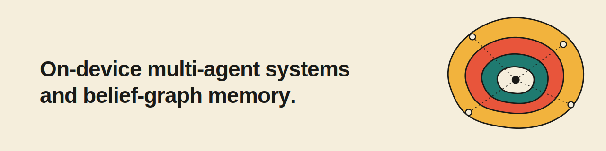

## Sam Jones

Cofounder and Head of Engineering at **[Axiotic](https://axiotic.ai)**. We build governed multi-agent systems and belief-graph memory that run on local models — private, auditable, on-device. Based in Barcelona.

### Open source

Multi-Agent systems and models's run where your data lives.

- **[espigue](https://github.com/sam-at-axiotic/espigue)** — topic in, cited literature review out. Drives the search from the disagreements and gaps it finds; every citation and quote is mechanically verified. pip-installable, OpenRouter-backed.
- **[traitseed](https://github.com/sam-at-axiotic/traitseed)** — reproducible diversity for LLM data generation, seeded from curated trait lattices.

### Elsewhere

[axiotic.ai](https://axiotic.ai) · [LinkedIn](https://www.linkedin.com/in/samuel-jonathan-jones) · sam@axiotic.ai
